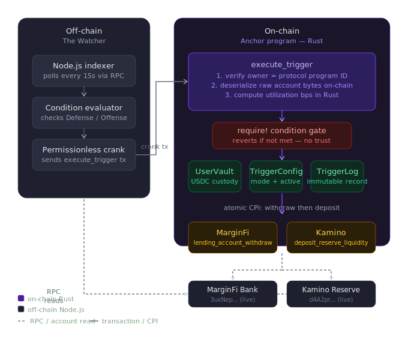

# Aegis

Aegis is a trustless, cross-protocol automation layer for Solana DeFi. It monitors lending protocol health in real time and automatically moves your capital to safety or to higher yield in a single atomic transaction. No manual intervention. No idle capital. No trusted middleman.

The core guarantee: your funds can never be force-moved by a malicious actor. The off-chain monitoring service only sends a signal. The on-chain Rust program re-reads live protocol state itself and reverts the entire transaction if the condition is not actually met. The safety is mathematical, not operational.

---

## The problem

Lending protocols like MarginFi and Kamino become dangerous when utilization gets too high. When a pool approaches 95% utilization, withdrawals slow down or freeze entirely. Your capital is locked exactly when you need it most. Protecting yourself today means manually watching dashboards and hoping you react in time.

Existing stop-loss tools on Solana are siloed: they trigger a withdrawal but dump your capital into an idle wallet. Your money stops earning the moment the trigger fires.

---

## What Aegis does differently

Aegis does not just withdraw. It reroutes. In a single atomic transaction, it pulls your funds from the at-risk protocol and deposits them into a safer, still-productive alternative. Your capital never sits idle.

Two automation modes:

**Defense Mode** monitors MarginFi USDC utilization. If it crosses 90%, Aegis atomically withdraws your position and deposits it into Kamino before the pool locks.

**Offense Mode** continuously compares yields across protocols. If Kamino's effective yield exceeds MarginFi's by more than 2%, Aegis rebalances automatically to capture the higher return.

---

## How it works for a non-technical reader

You deposit USDC into Aegis and choose a mode. Aegis holds your funds and deploys them into MarginFi on your behalf. A background service watches protocol health around the clock. The moment a trigger condition is true, it sends a transaction to the Aegis smart contract.

Here is the critical part: the smart contract does not trust the background service. It reads the live state of MarginFi and Kamino directly from the blockchain, runs the math itself, and only moves your funds if the condition is genuinely met. If someone tried to send a fake trigger to steal your funds, the contract would see the numbers do not add up and reject the transaction entirely. Your money is protected by math, not by trusting a company.

---

## Why this is technically non-trivial

Most automation tools on Solana rely on Pyth or Switchboard price oracles. Aegis uses no external oracle.

The Rust program receives the live MarginFi `Bank` account and Kamino `Reserve` account as instruction inputs and deserializes their raw memory buffers directly on-chain. It executes the utilization formula natively in fixed-point Rust arithmetic. The blockchain itself evaluates whether the condition is met.

This approach means:

No oracle staleness. The program reads the current slot's state, not a price feed from a previous block.

No trusted data provider. The math runs inside the Solana runtime with zero external dependency.

No manipulation surface. A malicious crank cannot fake protocol state because the program reads it directly from the account owned by the MarginFi and Kamino programs themselves.

The CPI interfaces for interacting with MarginFi and Kamino are generated at compile time using Anchor's `declare_program!` macro from their stripped on-chain IDLs. No external crates. No version conflicts with Anchor 0.32.

---

## Architecture



**On-chain state:**

| Account         | Seeds                   | Purpose                                                     |
| --------------- | ----------------------- | ----------------------------------------------------------- |
| `UserVault`     | `[b"vault", user]`      | Custodies USDC, tracks which protocol currently holds funds |
| `TriggerConfig` | `[b"trigger", user]`    | Mode, active flag, execution counter                        |
| `TriggerLog`    | `[b"log", user, count]` | Immutable record of each execution with protocol snapshots  |

**Instructions:**

| Instruction        | Caller                         | What it does                                            |
| ------------------ | ------------------------------ | ------------------------------------------------------- |
| `initialize_vault` | User                           | Creates vault PDA and USDC token account                |
| `deposit`          | User                           | Transfers USDC into vault, routes to MarginFi           |
| `set_trigger`      | User                           | Arms Defense or Offense mode                            |
| `execute_trigger`  | Indexer crank (permissionless) | Validates condition on-chain, atomically reroutes funds |
| `cancel_trigger`   | User                           | Disarms trigger                                         |
| `withdraw`         | User                           | Returns USDC to wallet                                  |

---

## On-chain validation in detail

When `execute_trigger` is called, the program:

1. Receives the MarginFi `Bank` account as a remaining account
2. Verifies its owner is the MarginFi program (`MFv2hWf31Z9kbCa1snEPYctwafyhdvnV7FZnsebVacA`)
3. Deserializes `total_asset_shares` and `total_liability_shares` from raw bytes (I80F48 fixed-point at offsets 248 and 264, validated against live state before deployment)
4. Computes `utilization_bps = (liabilities * 10000) / assets`
5. Repeats for the Kamino `Reserve` account
6. Evaluates the trigger condition via `require!` which reverts the transaction if false
7. If the condition is confirmed, executes CPIs: MarginFi `lending_account_withdraw` followed by Kamino `deposit_reserve_liquidity`
8. Creates an immutable `TriggerLog` with the utilization snapshot from that exact slot

The permissionless crank design means anyone can run an indexer. Aegis is not dependent on a single operator staying online.

---

## Repository structure

```
aegis/
├── anchor/
│   ├── programs/aegis/
│   │   ├── idls/
│   │   │   ├── marginfi_stripped.json
│   │   │   └── kamino_lend_stripped.json
│   │   └── src/
│   │       ├── lib.rs
│   │       ├── errors.rs
│   │       ├── state/
│   │       │   ├── vault.rs
│   │       │   ├── trigger.rs
│   │       │   └── log.rs
│   │       └── instructions/
│   │           ├── initialize_vault.rs
│   │           ├── deposit.rs
│   │           ├── set_trigger.rs
│   │           ├── execute_trigger.rs
│   │           ├── cancel_trigger.rs
│   │           └── withdraw.rs
│   └── tests/
├── docs/
│   └── architecture.svg
├── frontend/                       React + Vite + TailwindCSS
└── backend/                        Node.js indexer (The Watcher)
```

---

## Running locally

Prerequisites: Rust, Anchor CLI 0.32.1, Node.js 18+, Solana CLI configured for devnet.

```bash
git clone https://github.com/your-handle/aegis
cd aegis/anchor

# Build the program
anchor build

# Start a mainnet-fork local validator
solana-test-validator \
  --url mainnet-beta \
  --clone MFv2hWf31Z9kbCa1snEPYctwafyhdvnV7FZnsebVacA \
  --clone 3uxNepDbmkDNq6JhRja5Z8QwbTrfmkKP8AKZV5chYDGG \
  --clone KLend2g3cP87fffoy8q1mQqGKjrxjC8boSyAYavgmjD \
  --clone d4A2prbA2whesmvHaL88BH6Ewn5N4bTSU2Ze8P6Bc4Q \
  --reset

# Validate account reads before deploying
npx tsx scripts/validate_accounts.ts

# Deploy
anchor deploy

# Start backend indexer
cd ../backend && npm install && node index.js

# Start frontend
cd ../frontend && npm install && npm run dev
```

---

## Technical decisions

**`declare_program!` over external crates.** `marginfi-cpi` and `kamino-lend` crates target Anchor 0.29 and are incompatible with 0.32 due to borsh and bytemuck version conflicts. `declare_program!` generates typed CPI interfaces directly from the fetched on-chain IDLs at compile time. Zero external protocol dependencies.

**Raw byte deserialization for condition reads.** Utilization is computed by reading account bytes at known, pre-validated offsets rather than importing full protocol type crates. This avoids architecture-specific compile constraints (MarginFi's full crate only compiles on x86) and works with any Anchor version. The offsets are verified against live protocol state by the validation script before every deployment.

**Fixed-point arithmetic throughout.** All math uses `checked_mul`, `checked_div`, and `checked_add`. Integer overflow produces `AegisError::MathOverflow` rather than a panic. MarginFi's I80F48 values are compared as raw u128 ratios. The 2^48 scale factor cancels in the division, so no lossy float conversion is needed.

**Permissionless crank with on-chain re-validation.** The indexer is untrusted by design. Any party can send `execute_trigger`. The program is the sole authority on whether a condition is met.

**Single trigger per user (current scope).** `TriggerConfig` uses seeds `[b"trigger", user]`, giving one trigger per wallet. This keeps the account model simple and the instruction set minimal. Multiple triggers per user would require an additional counter seed and a `TriggerRegistry` account, which is a planned extension.

---

## Key addresses

| Account             | Address                                        |
| ------------------- | ---------------------------------------------- |
| MarginFi program    | `MFv2hWf31Z9kbCa1snEPYctwafyhdvnV7FZnsebVacA`  |
| MarginFi USDC Bank  | `3uxNepDbmkDNq6JhRja5Z8QwbTrfmkKP8AKZV5chYDGG` |
| Kamino program      | `KLend2g3cP87fffoy8q1mQqGKjrxjC8boSyAYavgmjD`  |
| Kamino USDC Reserve | `d4A2prbA2whesmvHaL88BH6Ewn5N4bTSU2Ze8P6Bc4Q`  |
| USDC mint           | `EPjFWdd5AufqSSqeM2qN1xzybapC8G4wEGGkZwyTDt1v` |

---

## Deployed program

| Network | Program ID                     |
| ------- | ------------------------------ |
| Devnet  | `YOUR_PROGRAM_ID_AFTER_DEPLOY` |

Frontend: `YOUR_DEPLOYMENT_URL`
